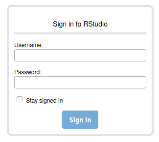
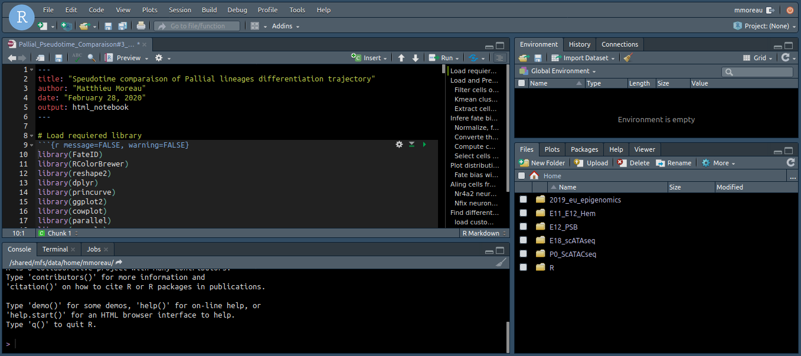

# How to connect to the IFB Rstudio server

In a web browser, connect to https://rstudio.cluster.france-bioinformatique.fr/ and log in using your IFB username and password.

You will reached the familiar Rstudio environment:

